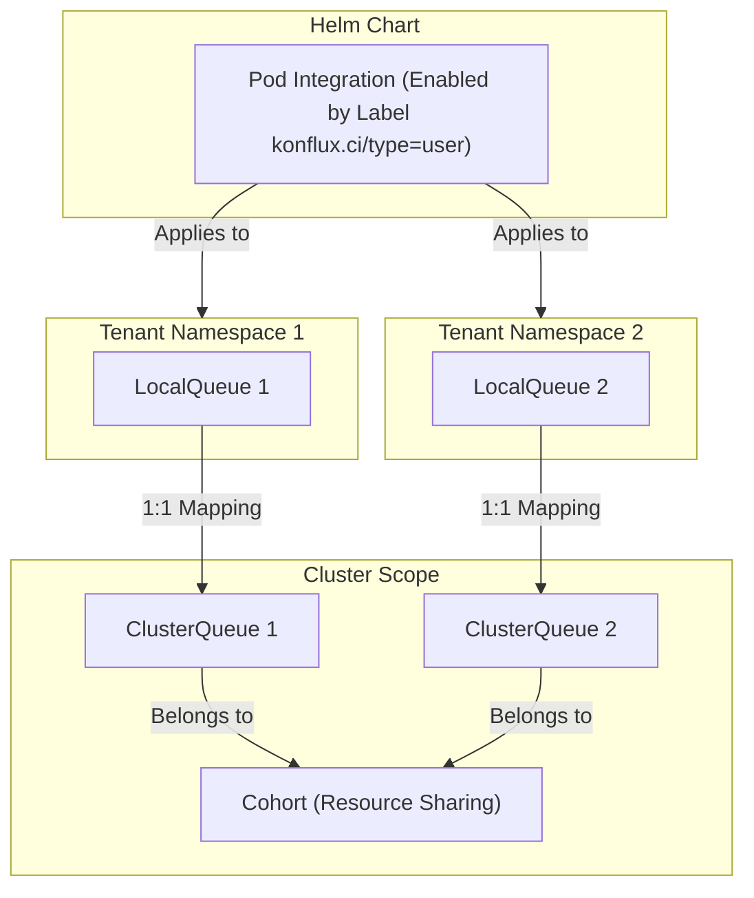

# Kueue Pods Demo

This document demonstrates the potential use of Kueue's queue for pods within Konflux.
It's based on the [Kueue's pod integration](https://kueue.sigs.k8s.io/docs/tasks/run/plain_pods/)

## Details and Queue Layout

In Konflux, each tenant has its own namespace.
We will create a `ClusterQueue` for each tenant. The `ClusterQueue` will contain the resource limits for its tenant.

Additionally, a `LocalQueue` will be created in each tenant namespace. This will be the default queue and will have a one-to-one mapping with the `ClusterQueue` for that namespace.

The `ClusterQueue` will accept workloads only from its matching `LocalQueue` (selected by a label).

All `ClusterQueues` for Konflux tenant namespaces will belong to the same cohort, allowing resource sharing.

The pod integration for the queue is activated using the Helm chart. It will be enabled by default
for all Konflux tenant namespaces labeled with `konflux.ci/type=user`.

## Setup the Environment

1. Deploy `konflux-ci/konflux-ci` on a local `kind` cluster by [following the steps in the README](https://github.com/konflux-ci/konflux-ci?tab=readme-ov-file#trying-out-konflux). Make sure to enable the [image-controller](https://github.com/konflux-ci/konflux-ci/blob/main/docs/quay.md#automatically-provision-quay-repositories-for-container-images) and [smee integration](https://github.com/konflux-ci/konflux-ci?tab=readme-ov-file#enable-pipelines-triggering-via-webhooks).

2. Deploy Kueue using the Helm chart by following [these steps](https://github.com/kubernetes-sigs/kueue/blob/main/charts/kueue/README.md). Make sure to use the `values` file from this repository.

3. Deploy the `kueue-demo.yaml` file. This will set up the queues for the namespaces `user-ns1` and `user-ns2`.

4. Onboard the [test component](https://github.com/konflux-ci/testrepo) (you will need to create two repositories from the template) to `user-ns1` and `user-ns2`. [Details on how to onboard a component using the UI](https://github.com/konflux-ci/konflux-ci?tab=readme-ov-file#option-1-onboard-application-with-the-konflux-ui).

---
